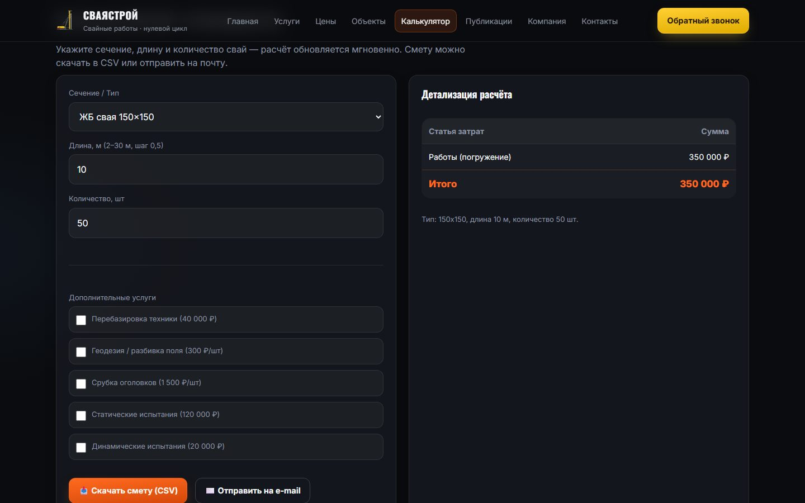
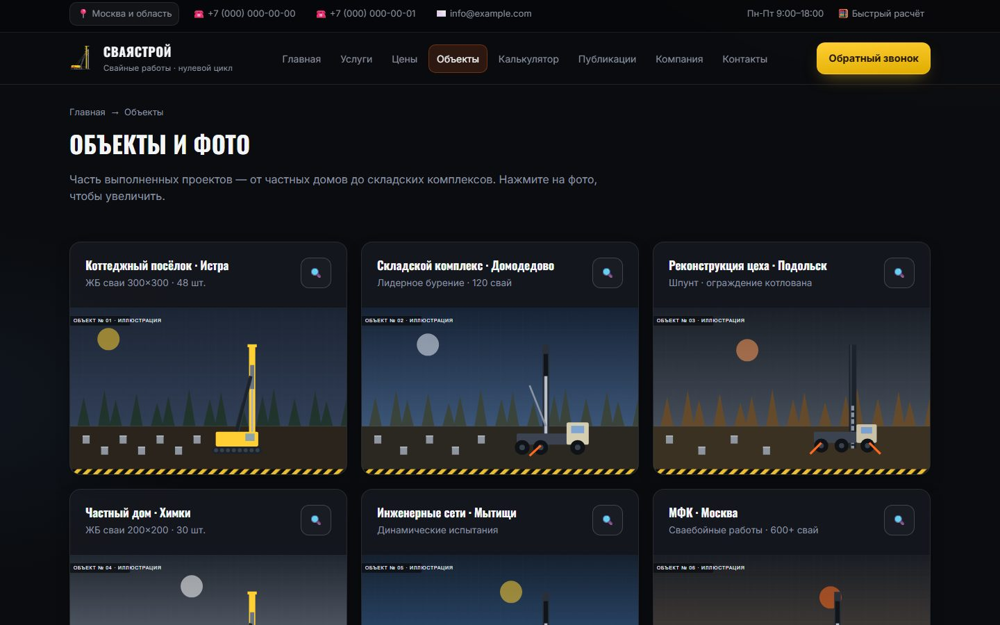

# СваяСтрой — демо-сайт компании по свайным работам

Многостраничный сайт подрядчика по свайным работам: каталог услуг, прайс, портфолио объектов, блог, онлайн-калькулятор сметы и формы заявок с отправкой на почту через собственный Node.js-бэкенд.

> Компания «СваяСтрой», её контакты, адрес, документы и объекты вымышленные. Телефоны, почта и реквизиты — заглушки, фото объектов заменены иллюстрациями.

**Демо:** https://verbickijdmitrij503-source.github.io/svayastroy-site/ &nbsp;·&nbsp; *на GitHub Pages формы работают в демо-режиме — данные никуда не отправляются*


## Что сделано

- **10 страниц без фреймворков** — чистые HTML, CSS и JavaScript (ES-модули). Каталог услуг, объекты и статьи рендерятся из одного файла данных (`assets/js/data.js`), поэтому контент правится в одном месте.
- **Калькулятор стоимости** — расчёт в реальном времени по сечению, длине и количеству свай, скидки за объём, дополнительные опции, выгрузка сметы в CSV и отправка расчёта менеджеру.
- **Формы заявок** — модальное окно «Обратный звонок» и формы на страницах; валидация на клиенте (HTML5 + свои сообщения) и на сервере (Zod).
- **Бэкенд на Express** — отдаёт статику и принимает заявки через `/api/forms/*`. Защита: Helmet (CSP), rate limiting, CORS. Почта уходит через Nodemailer; в dev-режиме письма не отправляются, а сохраняются как HTML-превью.
- **Адаптивная вёрстка** — единая система брейкпоинтов (1180 / 980 / 760 / 420 px), бургер-меню, выпадающие меню с поддержкой клавиатуры и touch.
- **Интерфейс** — тёмная «индустриальная» тема с сигнальной разметкой, слайдер техники, лайтбокс для фото объектов, анимации появления и счётчики с учётом `prefers-reduced-motion`.
- **SEO** — мета-теги и Open Graph, JSON-LD (Organization, LocalBusiness, Service, Article), `sitemap.xml`, `robots.txt`. Для страниц услуг и статей SEO-теги подставляются динамически.

| Калькулятор | Объекты |
|---|---|
|  |  |

| Услуги | Мобильная версия |
|---|---|
|  |  |

## Стек

**Фронтенд:** HTML5, CSS3 (custom properties, Grid, Flexbox), Vanilla JS (ES-модули, IntersectionObserver)
**Бэкенд:** Node.js 18+, Express 4, Nodemailer, Zod, Helmet, express-rate-limit, dotenv

## Структура

```
├── index.html, services.html, service.html, prices.html,
│   projects.html, calculator.html, blog.html, article.html,
│   about.html, contacts.html
├── assets/
│   ├── css/styles.css      # вся стилизация
│   ├── js/main.js          # навигация, модалка, слайдер, лайтбокс, рендер данных
│   ├── js/calculator.js    # логика калькулятора и экспорт CSV
│   ├── js/api.js           # отправка форм (+ демо-режим без бэкенда)
│   ├── js/data.js          # услуги, техника, объекты, статьи
│   ├── img/                # иконки, логотип, иллюстрации объектов
│   └── docs/               # образцы документов (PDF-заглушки)
└── backend/
    ├── src/server.js       # Express: статика + API форм
    ├── src/mailer.js       # отправка писем / dev-превью
    ├── src/validation.js   # схемы Zod
    ├── src/config.js       # конфигурация из .env
    └── scripts/validate-project.mjs  # проверка битых ссылок и синтаксиса JS
```

## Запуск локально

```bash
cd backend
npm install
cp .env.dev.example .env    # в Windows: copy .env.dev.example .env
npm run dev
```

Сайт откроется на http://localhost:4000. В dev-режиме заявки не уходят на почту, а сохраняются в `backend/test-mails/`, и превью письма открывается в новой вкладке.

Для реальной отправки заполните `.env` по образцу `.env.prod.example` (SMTP-сервер, логин, пароль) и выставьте `MAIL_MODE=prod`.

Проверка проекта (битые ссылки, синтаксис JS):

```bash
npm run check
```

## Публикация на GitHub Pages

1. Загрузите репозиторий на GitHub.
2. **Settings → Pages → Build and deployment → Deploy from a branch**, ветка `main`, папка `/ (root)`.
3. Через минуту сайт будет доступен по адресу `https://verbickijdmitrij503-source.github.io/svayastroy-site/`.

На GitHub Pages нет сервера, поэтому `api.js` автоматически переключает формы в демо-режим: валидация работает, но после отправки показывается уведомление «Демо-режим».

## Автор

[Дмитрий](https://github.com/verbickijdmitrij503-source) — дизайн, вёрстка, фронтенд и бэкенд.
